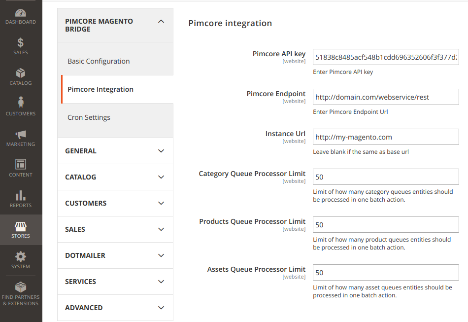
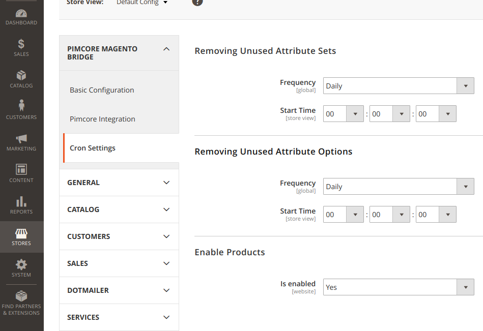

# Magento 2 - Pimcore Integration Module
This module is a part of integration between Magento 2 and Pimcore. 

* Manage your products in Pimcore. Enrich them by creating new attributes to suit your needs or by using existing one. Then simply publish them and export to Magento with one click.
* Create categories, build a tree and export it easily to Magento.
* Build up you media gallery, assign assets and publish.

**Table of Contents**

- [Magento 2 - Pimcore Integration Module](#)
    - [Big Picture](#big-picture)
	- [Compatibility](#compatibility)
	- [Installing/Getting started](#installation)
	- [Features](#features)
		- [Product Integration](#f1)
		- [Attributes Integration](#f2)
		- [Categories Integration](#f3)
		- [Assets Integration](#f4)
		- [Stores Integration](#f5)
		- [Dynamic creation of attribute sets](#f6)
		- [Translations](#7)
		- [Unused options and attribute sets collector](#8)
	- [Configuration](#configuration)
	- [Contributing](#contributing)
	- [Licensing](#licensing)
	- [Standards & Code Quality](#qa)
	- [About Authors](#authors)
	

## Big Picture

## Compatibility

This module is compatible with Magento 2.2.*

## Installing/Getting started
###
1. require with composer `composer require divante/module-pimcore5-integration` or copy files to `<root>/app/code/Divante/PimcoreIntegration`
2. `php bin/magento setup:upgrade`
3. `php bin/magento module:enable Divante_PimcoreIntegration`
4. configure module in admin panel

## Features
Module introduces a broad integration of basic entities available in Magento.

#### Product Integration
The folowwing types of products are supported:

* simple product
* configurable product

#### Attributes Integration
The following types of attributes are supported:

* boolean (yes/no)
* text
* textarea
* select
* multiselect
* wysiwyg
* object

Object is a special type that emits an event which allows to implement any complex attribute type by 3rd party services.

#### Categories integration
Import of categories from Pimcore, eventually structured in a tree.

#### Assets integration
Keep your media gallery in Pimcore, assign them to category or product - and publish.

#### Dynamic creation of attribute sets
Module detects if attributes on product belongs to existing attribute set and eventually create new.

#### Multistore support
Integration supports multistore, therefore any entity can be updated only in a predefined store.

#### Translations
All data can be easily translated including attributes' labels and options.

#### Unused options and attribute sets collector
Whenever module detect that some options or attribute sets are not used it will remove them to prevent storing unnecessary data in a database.

## Configuration
Configuration is available in Admin Panel; Stores->Configuration->Pimcore Magento Bridge

#### Basic configuration

* **enable pimcore-magento bridge integration** - enable/disable module's functionality
    * yes
    * no
* **logger handler**
    * stream
    * graylog (unavailable yet)
* **outdated queues** - allows to remove old entries on queue stack

#### Pimcore Integration

* **Pimcore Api Key** - api key of integration configured in pimcore
* **Pimcore Endpoint** - pimcore api endpoint [domain]/webservice/rest
**IMPORTANT! "webservice/rest" is a mandatory part**
* **Instance Url** - instance url of magento which serves as communication identifier. In most cases it is the same as current instance's base url.
* **Category Queue Processor Limit** - Limit of how many category queues entities should be processed in one batch action.
* **Products Queue Processor Limit** - Limit of how many product queues entities should be processed in one batch action.
* **Assets Queue Processor Limit** - Limit of how many asset queues entities should be processed in one batch action.

#### Cron Settings

* **Remove Unused Attribute Sets** - removes attribute sets that are not used by any product
* **Remove Unused Attribute Options** - removes options that are not used by any select/multiselect attribute type
* **Enable Products** - is enabling products which have at least one image, stock and price set.

##### Products
More types of products must be covered in integration therefore we are aiming to implement bundle and grouped product types.

##### Tests
1. Refactorization of unit/integration test - some of test are broken at the moment due to regression and must be updated.
2. Write integration tests to cover most important scenarios

## Contributing

If you'd like to contribute, please fork the repository and use a feature branch. Pull requests are warmly welcome.

## Licensing
The code in this project is licensed under the MIT license.

## Standards & Code Quality
This module respects all Magento2 code quality rules and our own PHPCS and PHPMD rulesets.

## About Authors

Founded in 2008, Divante is an expert in providing top-notch eCommerce solutions and products for both B2B and B2C segments. By supporting our clients in sales growth, we define completely novel ideas, implement the latest technologies, and deliver an unprecedented user experience.

We work with industry leaders, like T-Mobile, Continental, and 3M, who perceive technology as their key component to success. 

Our team of 170+ in-house experts from various fields includes 30+ certified Magento developers, 30+ Pimcore developers, JS developers (Vue, Angular, React), product designers, analysts, project managers & testers.

As a digital pioneer and strategic partner, our core competencies are focused on the enterprise open source software ecosystem and customized software solutions (we love Pimcore, Magento, Symfony3, Node.js, Angular, React, Vue.js and many others). We offer innovative solutions for eCommerce system and support ERP, PIM, and CRM solutions- to list just a few.

In Divante we trust in cooperation, that's why we contribute to open source products and create our own products like [Open Loyalty](http://www.openloyalty.io/ "Open Loyalty") and [Vue.js Storefront](https://github.com/DivanteLtd/vue-storefront "Vue.js Storefront").

OUR SERVICES

* **VueJs, Angular, React**
* **Microservices for eCommerce**
* **Magento Development**
* **Pimcore Development**
* **OroCommerce Development**
* **Frontend development for: PrestaShop, Shopware, SAP hybris, Shopify**
* **Integrations**

We are part of the OEX Group which is listed on the Warsaw Stock Exchange. Our annual revenue has been growing at a minimum of about 30% year on year.

Visit our website [Divante.co](https://divante.co/ "Divante.co") for more information.
